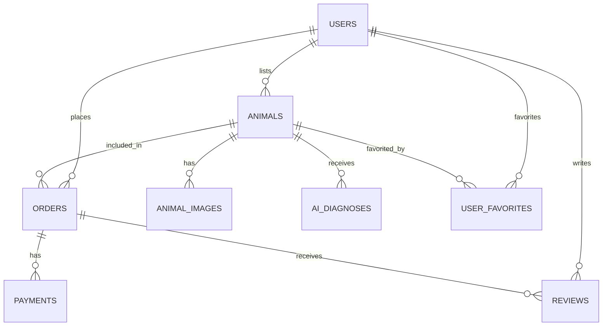

# Reptory 데이터베이스 스키마 (Phase 기반)

## 📌 중요: Phase별 DB 진화 전략

### 원칙
1. **Phase 1-4**: 로컬스토리지만 사용 (DB 없음)
2. **Phase 5**: 실제 DB 구축 및 마이그레이션
3. **각 Phase 완료 시 스키마 프리징**
4. **스키마 변경 시 반드시 사용자 확인**

## 🗂 Phase별 데이터 구조

### Phase 1: 기본 UI (로컬스토리지)
```typescript
// localStorage 키: 'reptory_phase1'
interface Phase1Data {
  animals: {
    id: string;
    title: string;
    species: string;
    price: number;
    images: string[];
    description: string;
    createdAt: string;
  }[];
  
  favorites: string[]; // animal IDs
  
  viewHistory: {
    animalId: string;
    viewedAt: string;
  }[];
}
```

### Phase 2: AI 진단 추가
```typescript
// localStorage 키: 'reptory_phase2'
interface Phase2Data extends Phase1Data {
  diagnoses: {
    id: string;
    animalId: string;
    healthScore: number; // 1-10
    healthStatus: {
      skin: number;
      eyes: number;
      body: number;
      behavior: number;
    };
    morphAnalysis: {
      primary: string;
      secondary: string[];
      confidence: number;
    };
    recommendations: string[];
    diagnosedAt: string;
    pdfDataUrl?: string; // Base64 PDF
  }[];
  
  // animals에 추가 필드
  animals: Array<Phase1Data['animals'][0] & {
    morph?: string;
    healthStatus?: 'excellent' | 'good' | 'fair' | 'needs_care';
    isVerified?: boolean;
    diagnosisId?: string;
  }>;
}
```

### Phase 3: 거래 플로우 추가
```typescript
// localStorage 키: 'reptory_phase3'
interface Phase3Data extends Phase2Data {
  orders: {
    id: string;
    animalId: string;
    buyerInfo: {
      name: string;
      phone: string;
      email: string;
      address: string;
    };
    sellerInfo: {
      name: string;
      phone: string;
    };
    price: number;
    shippingFee: number;
    totalAmount: number;
    status: 'pending' | 'paid' | 'shipping' | 'completed' | 'cancelled';
    createdAt: string;
  }[];
  
  // 간단한 사용자 프로필
  userProfile: {
    type: 'buyer' | 'seller' | 'both';
    name: string;
    phone: string;
    email: string;
  };
}
```

### Phase 4: 검색/필터/리뷰 추가
```typescript
// localStorage 키: 'reptory_phase4'
interface Phase4Data extends Phase3Data {
  reviews: {
    id: string;
    orderId: string;
    rating: number; // 1-5
    title: string;
    content: string;
    images?: string[];
    createdAt: string;
  }[];
  
  searchHistory: string[];
  
  filterPresets: {
    name: string;
    filters: {
      species?: string[];
      priceRange?: [number, number];
      healthStatus?: string[];
      verified?: boolean;
    };
  }[];
  
  // 병원 쿠폰 시뮬레이션
  coupons: {
    id: string;
    orderId: string;
    code: string;
    discount: number;
    hospitalName: string;
    expiresAt: string;
    used: boolean;
  }[];
}
```

## 🗄 Phase 5: 실제 데이터베이스 스키마

### 데이터베이스 개요
- **데이터베이스**: PostgreSQL (Supabase)
- **인증**: Supabase Auth
- **스토리지**: Supabase Storage
- **실시간**: Supabase Realtime

### ERD (Entity Relationship Diagram)


### 핵심 테이블 (Phase 5 초기)

#### users (사용자)
```sql
CREATE TABLE users (
    id UUID PRIMARY KEY DEFAULT auth.uid(),
    email VARCHAR(255) UNIQUE NOT NULL,
    full_name VARCHAR(100) NOT NULL,
    phone VARCHAR(20),
    user_type VARCHAR(20) DEFAULT 'buyer', -- buyer, seller, both
    created_at TIMESTAMP WITH TIME ZONE DEFAULT NOW()
);
```

#### animals (동물)
```sql
CREATE TABLE animals (
    id UUID PRIMARY KEY DEFAULT gen_random_uuid(),
    user_id UUID NOT NULL REFERENCES users(id),
    title VARCHAR(200) NOT NULL,
    species VARCHAR(50) NOT NULL,
    morph VARCHAR(200),
    price INTEGER NOT NULL,
    description TEXT,
    health_status VARCHAR(20),
    is_verified BOOLEAN DEFAULT FALSE,
    created_at TIMESTAMP WITH TIME ZONE DEFAULT NOW()
);
```

#### animal_images (이미지)
```sql
CREATE TABLE animal_images (
    id UUID PRIMARY KEY DEFAULT gen_random_uuid(),
    animal_id UUID NOT NULL REFERENCES animals(id) ON DELETE CASCADE,
    image_url TEXT NOT NULL,
    display_order INTEGER DEFAULT 0,
    created_at TIMESTAMP WITH TIME ZONE DEFAULT NOW()
);
```

#### ai_diagnoses (AI 진단)
```sql
CREATE TABLE ai_diagnoses (
    id UUID PRIMARY KEY DEFAULT gen_random_uuid(),
    animal_id UUID NOT NULL REFERENCES animals(id),
    health_score INTEGER CHECK (health_score >= 1 AND health_score <= 10),
    health_details JSONB NOT NULL,
    morph_analysis JSONB,
    recommendations JSONB,
    pdf_url TEXT,
    diagnosed_at TIMESTAMP WITH TIME ZONE DEFAULT NOW()
);
```

#### orders (주문)
```sql
CREATE TABLE orders (
    id UUID PRIMARY KEY DEFAULT gen_random_uuid(),
    buyer_id UUID NOT NULL REFERENCES users(id),
    seller_id UUID NOT NULL REFERENCES users(id),
    animal_id UUID NOT NULL REFERENCES animals(id),
    total_amount INTEGER NOT NULL,
    status VARCHAR(20) DEFAULT 'pending',
    buyer_info JSONB NOT NULL,
    created_at TIMESTAMP WITH TIME ZONE DEFAULT NOW()
);
```

#### reviews (리뷰)
```sql
CREATE TABLE reviews (
    id UUID PRIMARY KEY DEFAULT gen_random_uuid(),
    order_id UUID NOT NULL REFERENCES orders(id),
    reviewer_id UUID NOT NULL REFERENCES users(id),
    rating INTEGER CHECK (rating >= 1 AND rating <= 5),
    title VARCHAR(200),
    content TEXT NOT NULL,
    created_at TIMESTAMP WITH TIME ZONE DEFAULT NOW()
);
```

#### user_favorites (찜하기)
```sql
CREATE TABLE user_favorites (
    user_id UUID NOT NULL REFERENCES users(id),
    animal_id UUID NOT NULL REFERENCES animals(id),
    created_at TIMESTAMP WITH TIME ZONE DEFAULT NOW(),
    PRIMARY KEY (user_id, animal_id)
);
```

## 🔄 마이그레이션 전략

### Phase 4 → Phase 5 데이터 마이그레이션
```typescript
// migration/localToSupabase.ts
async function migrateFromLocalStorage() {
  const phase4Data = localStorage.getItem('reptory_phase4');
  if (!phase4Data) return;
  
  const data = JSON.parse(phase4Data) as Phase4Data;
  
  // 1. 사용자 생성 (임시)
  const { user } = await supabase.auth.signUp({
    email: data.userProfile.email,
    password: 'temporary-password'
  });
  
  // 2. 동물 데이터 마이그레이션
  for (const animal of data.animals) {
    const { data: newAnimal } = await supabase
      .from('animals')
      .insert({
        title: animal.title,
        species: animal.species,
        price: animal.price,
        // ... 기타 필드
      })
      .select()
      .single();
      
    // 3. 이미지 마이그레이션
    // 4. AI 진단 마이그레이션
    // 5. 주문 마이그레이션
  }
}
```

## 📋 스키마 변경 체크리스트

### Phase 전환 시 확인사항
- [ ] 새로운 필드가 필요한가?
- [ ] 기존 데이터 구조 변경이 필요한가?
- [ ] 데이터 타입 변경이 있는가?
- [ ] 관계 변경이 필요한가?

### 변경 시 프로세스
1. 변경사항 문서화
2. 사용자에게 확인 요청
3. 승인 후 구현
4. 마이그레이션 스크립트 작성

## 🔐 보안 정책 (Phase 5)

### Row Level Security (RLS)
```sql
-- 자신의 동물만 수정 가능
CREATE POLICY "Users can update own animals" ON animals
    FOR UPDATE USING (auth.uid() = user_id);

-- 모든 사용자가 활성 동물 조회 가능
CREATE POLICY "Anyone can view active animals" ON animals
    FOR SELECT USING (true);

-- 자신의 주문만 조회 가능
CREATE POLICY "Users can view own orders" ON orders
    FOR SELECT USING (
        auth.uid() = buyer_id OR 
        auth.uid() = seller_id
    );
```

## 📊 인덱스 전략 (Phase 5)

### 성능 최적화 인덱스
```sql
-- 자주 사용되는 검색
CREATE INDEX idx_animals_species ON animals(species);
CREATE INDEX idx_animals_price ON animals(price);
CREATE INDEX idx_animals_created_at ON animals(created_at DESC);

-- 복합 인덱스
CREATE INDEX idx_animals_species_price ON animals(species, price);
```

## 🚨 주의사항

1. **Phase 1-4는 로컬스토리지만 사용**
   - 실제 DB 연결 없음
   - 브라우저 데이터 초기화 시 손실
   - 개발/테스트 목적으로만 사용

2. **Phase 5 전환 시**
   - 모든 로컬 데이터 백업
   - 단계별 마이그레이션
   - 롤백 계획 수립

3. **스키마 변경**
   - 반드시 사용자 확인
   - 변경 영향도 분석
   - 마이그레이션 스크립트 준비